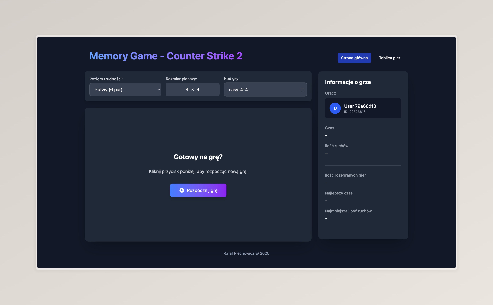

# Gra Memory CS2 – Vue 3 / TypeScript

Interaktywna gra typu *Memory* (odkryj pary kart) zbudowana w technologiach front-endowych najnowszej generacji.

---

## Spis treści
1. [Zrzut ekranu](#zrzut-ekranu)
2. [Technologie](#technologie)
3. [Wymagania](#wymagania)
4. [Instalacja](#instalacja)
5. [Skrypty npm](#skrypty-npm)
6. [Struktura projektu](#struktura-projektu)
7. [Autor i licencja](#autor-i-licencja)

## Zrzut ekranu


## Technologie
| Kategoria | Wykorzystane narzędzia |
| ------------------ | ---------------------- |
| Framework | [Vue 3](https://vuejs.org/) + `<script setup>` |
| Język | [TypeScript](https://www.typescriptlang.org/) |
| Bundler | [Vite](https://vitejs.dev/) |
| Zarządzanie stanem | [Pinia](https://pinia.vuejs.org/) |
| Stylowanie | [Tailwind CSS](https://tailwindcss.com/) |
| Auto-importy | [unplugin-auto-import](https://github.com/antfu/unplugin-auto-import) |
| Rejestracja komponentów | [unplugin-vue-components](https://github.com/antfu/unplugin-vue-components) |
| Ikony | [unplugin-icons](https://github.com/antfu/unplugin-icons) + [Iconify](https://iconify.design/) |
| Kompozycje pomocn. | [VueUse](https://vueuse.org/) |
| Lintowanie | ESLint + [`@antfu/eslint-config`](https://github.com/antfu/eslint-config) |

## Wymagania
* Node.js >= 18
* npm ≥ 9 (alternatywnie pnpm / yarn)

## Instalacja
```bash
# pobranie zależności
npm install

# uruchomienie środowiska developerskiego
npm run dev

# kompilacja produkcyjna
npm run build

# podgląd wersji produkcyjnej
npm run preview
```

## Skrypty npm
| Skrpyt | Opis |
| ---------------- | ---- |
| `dev` | Uruchamia serwer developerski Vite z hot-reloadem |
| `build` | Bundluje aplikację do `/dist` (tryb produkcyjny) |
| `preview` | Lokalny serwer podglądu zbudowanej aplikacji |
| `lint` | Uruchamia ESLint na plikach źródłowych |
| `lint:fix` | ESLint z automatyczną naprawą błędów |

## Struktura projektu (kluczowe pliki)
```
src/
├─ assets/          # grafiki, ikonki, pliki statyczne
├─ components/      # komponenty Vue (GameBoard.vue, NavBar.vue…)
├─ composables/     # logika współdzielona w stylu Composition API
├─ store/           # Pinia stores (np. game.ts)
├─ types/           # deklaracje TS (interface’y i typy wspólne)
└─ main.ts          # punkt wejścia aplikacji
```

## Autor i licencja
Projekt stworzony przez [Rafał Piechowicz](https://github.com/rpiechowicz) na potrzeby nauki i demo. Kod źródłowy dostępny jest na licencji **MIT** – możesz go dowolnie wykorzystywać, pamiętając o zachowaniu informacji o autorze.